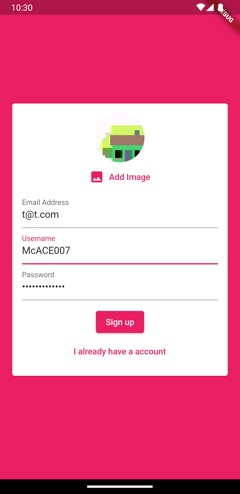

# Project Title

Flutter Group Chat App

The Flutter Group Chat App is a mobile application that allows users to chat with each other in a group chat setting. The app is built using Flutter, a cross-platform framework, and it utilizes Firebase for authentication, message storage, user profile image storage, and push notifications.

The app consists of two main screens. The first screen is the authentication screen, where users can log in or sign up. Firebase authentication is used to securely handle user authentication, allowing users to create accounts or log in using their email and password. This screen provides a seamless and secure login/signup experience for users.

Once authenticated, users are taken to the main chat screen. This screen displays a list of messages in a chat format, with the latest messages shown at the bottom. Firebase Firestore is used to store and retrieve messages, ensuring real-time synchronization and efficient data handling. Users can see the chat history and participate in ongoing conversations.

At the bottom of the chat screen, there is an input text field where users can type their messages. When the user taps the send button, their message is sent to Firebase Firestore, allowing it to be displayed to all users in the group chat. This enables seamless communication and interaction between users.

The chat screen also features an app bar at the top, which contains a button with a more_vert icon. Tapping on this button opens a dropdown menu with various options. One of the options is a logout button, allowing users to securely log out of their accounts. This ensures privacy and control over user sessions.

Furthermore, the app utilizes Firebase Storage to store user profile images. Users can set or update their profile images, which are stored securely on Firebase servers. This allows users to personalize their profiles and makes the chat experience more engaging and visually appealing.

To enhance the user experience and keep users informed, the app integrates Firebase Cloud Messaging for push notifications. Users receive notifications whenever there are new messages in the group chat, even if the app is not actively running. This feature ensures that users stay up-to-date with the ongoing conversations and never miss any important messages.

Overall, the Flutter Group Chat App provides users with a seamless and secure group chat experience. With Firebase integration for authentication, message storage, profile image storage, and push notifications, the app ensures a reliable and efficient communication platform for users to connect and interact in a group setting.

# 📸 Screenshots
The screenshots below are taken on an Android emulator.

| 1 | 2|
|------|-------|
|||

| 3 | 4|
|------|-------|
|||

| 5 | 6|
|------|-------|
|||

| 7 | 8|
|------|-------|
|||

| 9 |
|------|
||
